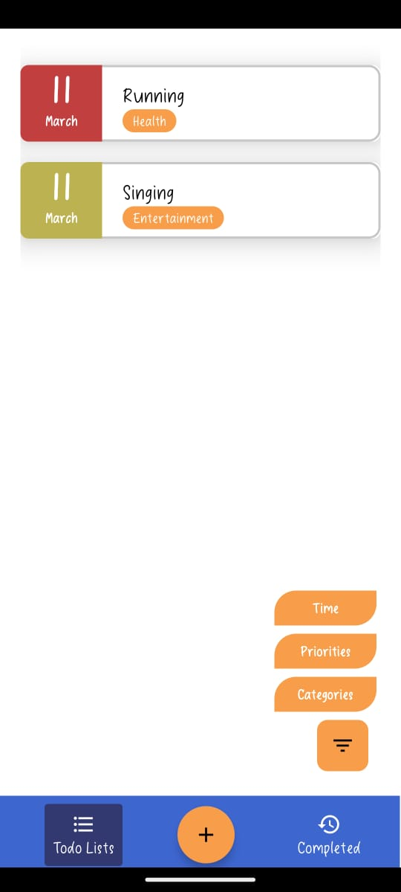
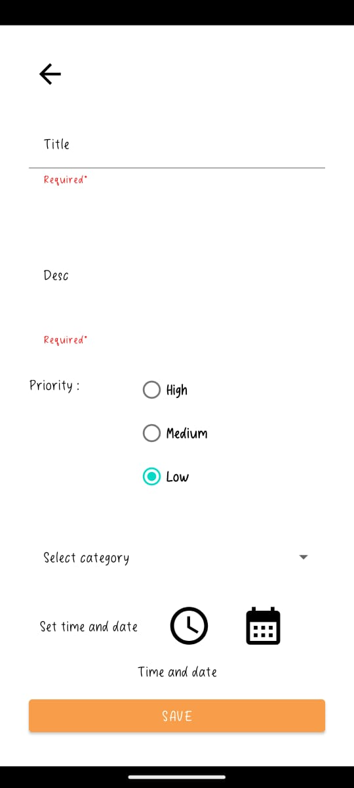
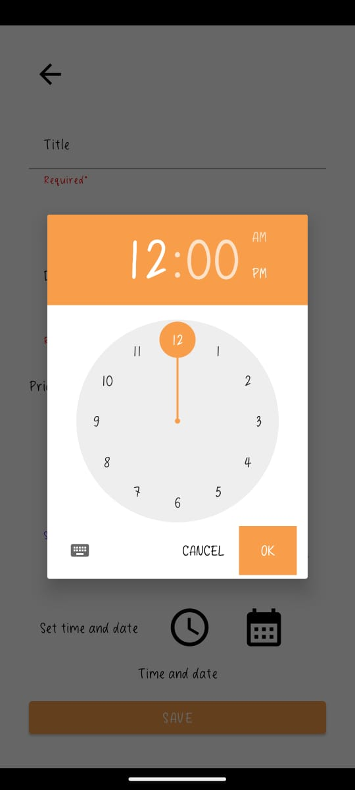

# TodoApp

TodoApp is a simple Android application for managing your tasks and to-do lists.

## Features

- Create, edit, and delete tasks
- Categorize tasks for better organization
- Set priorities for tasks
- Due date and time for time-sensitive tasks
- Mark tasks as completed
- History section for completed tasks

## Screenshots

  

  

  

  

  

   
   
   

## Getting Started

### Prerequisites

- Android Studio
- Android device.

### Installation

1. Clone the repository:

git clone https://github.com/yourusername/TodoApp.git

# TodoApp

TodoApp is a simple Android application for managing your tasks and to-do lists.

...

## Priority Indicators

In TodoApp, priority levels are visually represented by color-coded strips next to each task. Here's what each color signifies:

-  **Red Strip**: High Priority
-  **Yellow Strip**: Medium Priority
-  **Green Strip**: Low Priority

These indicators help you quickly identify and prioritize your tasks at a glance.

...

# TodoApp

TodoApp is a simple Android application for managing your tasks and to-do lists.

...

## Category Indicators

In TodoApp, task categories are visually represented by the color of the task button. Here's what each color signifies:

-  **Orange Button**: Entertainment
-  **Blue Button**: Studying
-  **Green Button**: Health

The color-coded buttons help you quickly identify the category of each task.

...

## Contributing

Thank you for considering contributing to the project! Contributions are encouraged and welcomed. To contribute, follow these steps:

1. Fork the repository.
2. Create a new branch for your feature: `git checkout -b feature/YourFeatureName`.
3. Make your changes and commit them: `git commit -m 'Add some feature'`.
4. Push to the branch: `git push origin feature/YourFeatureName`.
5. Open a pull request.

Please make sure to update tests and documentation as appropriate.

### Code of Conduct

This project follows a [Code of Conduct](CODE_OF_CONDUCT.md). By participating, you are expected to uphold this code.

## License

This project is licensed under the [MIT License](LICENSE). By contributing, you agree that your contributions will be licensed under its terms.

